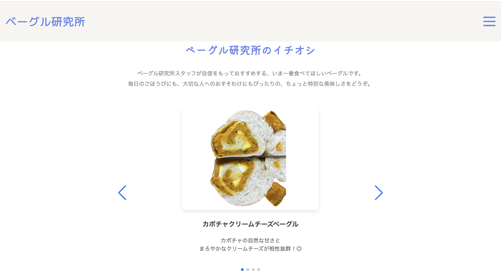
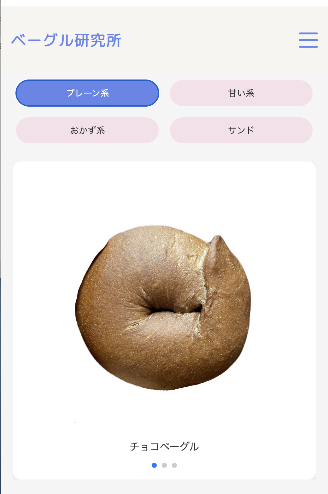

# ベーグル研究所

🥯 手作りベーグルの魅力を伝えるポートフォリオサイトです。

## 🔍 サイトについて

「自分でも作れるんじゃないか？」という気づきから始まったベーグル作り。  
そんな想いを込めて、デザイン・構成・コーディングまで一から作成しました。

## 🛠 使用技術

- HTML / CSS / JavaScript
- Swiper.js（スライダー）
- AOS（スクロールアニメーション）
- Google Fonts（M PLUS Rounded 1c）

## 🖼 スクリーンショット

### 💻 PC表示

### 📱 スマホ表示

## 🌐 公開URL

👉 (https://sakuppi.github.io/bagel.lab/)
## 📱 レスポンシブ対応

スマートフォン、タブレット、PC 各画面幅に対応しています。

## 📝 制作のこだわり

- カラーパレットはやさしい「ミルクベージュ × くすみブルー」で統一
- 自然な印象を出すため、フォントにも丸みや温かさを意識
- スクロールに合わせて自然に情報が伝わるよう、アニメーションや構成を丁寧に設計
---
